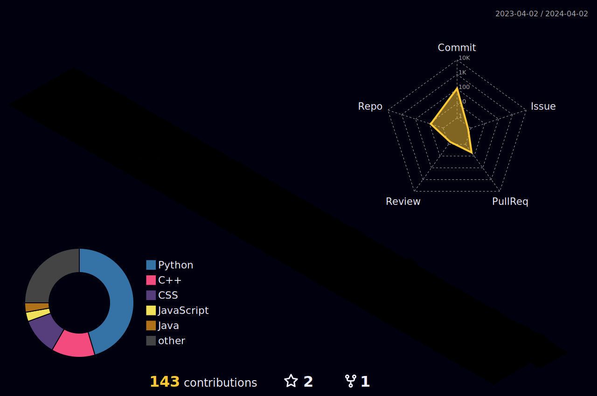

<!-- Intro  -->
<h3 align="center">I am <b><a target="_blank" href="https://www.bsanju.in">Sanjeevlu B</a></b>
        </samp>
</h3>

 
 
 
 
 
 

  </a> 

 

<!-- About Section -->

# About me

 
   
 🌐 &emsp; Exploring the vast world of technology and innovation  
 🛠️ &emsp; Building the future, one line of code at a time!  

 

 
 
 

## Use To Code

 

## Top Open Source

  

 

 

  

  

<a> 
    
  
   
</a>

## My activity:

