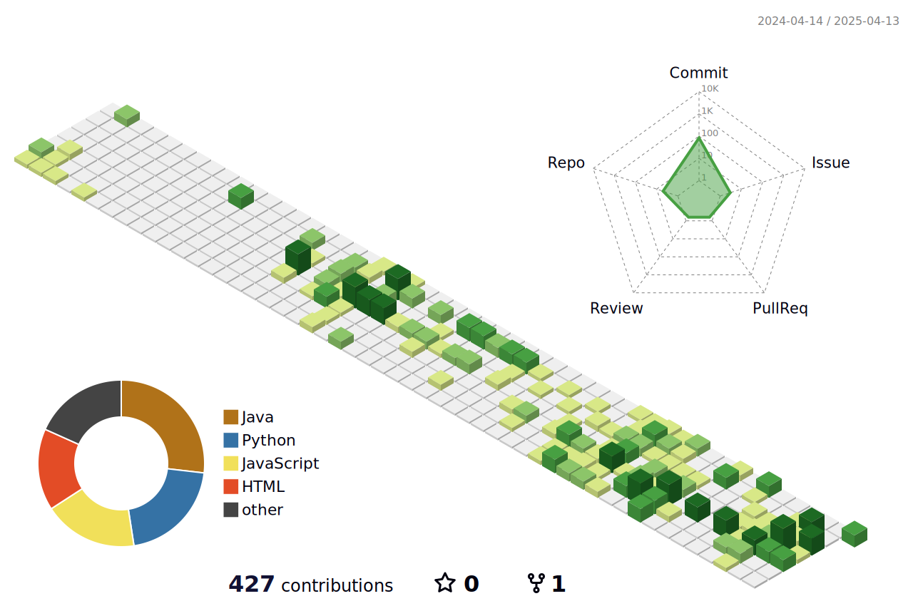

<!-- Intro  -->
<h3 align="center">
        <samp>&gt; Hey, I am
                <b><a target="_blank" href="https://www.bsanju.in">Sanjeevlu Buggargani</a></b>
        </samp>
</h3>

 
  <samp>
    <a href="https://www.google.com/search?q=Sanjeevlu+Buggargani">「 Google Me 」</a>
     
  </samp>

 
 
 
 
 

  </a> 

 

<!-- About Section -->

# About me

 
   
 🌐 &emsp; Exploring the vast world of technology and innovation  
 🛠️ &emsp; Building the future, one line of code at a time!  
 📧 &emsp; Reach me anytime: fastbootsanju@gmail.com  
 

 
 
 

## Use To Code

 

## Top Open Source

  

 

 

  

  

<a> 
    
  
   
</a>

## My activity:

